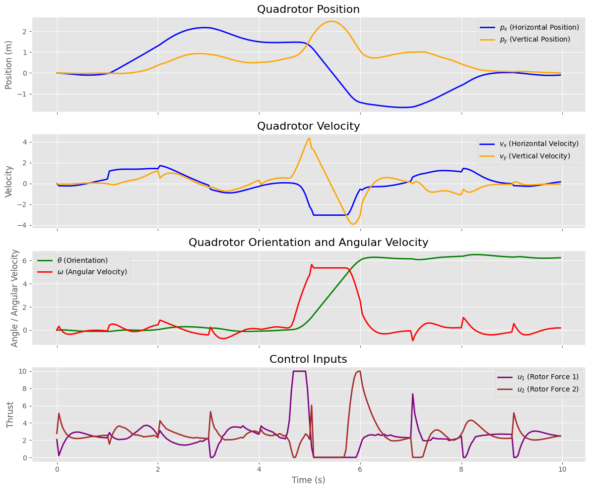
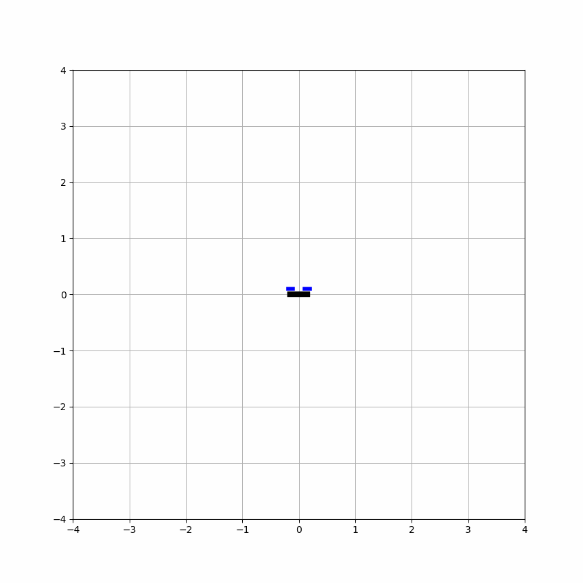

# 🚁 Looping a Quadrotor: SQP and MPC Control

This repository contains a comprehensive project showcasing **Sequential Quadratic Programming (SQP)** and **Model Predictive Control (MPC)** applied to achieve a looping trajectory for a quadrotor. The project uses CVXOPT based Quadratic Program solver, and optimization algorithms  to design controllers that guide the quadrotor through a looping motion - flipping of the drone.

---

## 📚 Project Overview

### System Dynamics
The quadrotor is modeled with the following dynamics:

$$
\begin{align}
\dot{p_x} &= v_x, \\
m \dot{v}_x &= - (u_1 + u_2) \sin \theta, \\
\dot{p_y} &= v_y, \\
m \dot{v}_y &= (u_1 + u_2) \cos \theta - m g, \\
\dot{\theta} &= \omega, \\
I \dot{\omega} &= r (u_1 - u_2).
\end{align}
$$

The goal is to control the quadrotor to complete a **looping trajectory** by solving optimization problems with SQP and MPC.

---

## ✨ Features

1. **SQP Implementation**:
   - Optimal control problem formulated as:

     $\min_{u_n, x_n} \frac{1}{2} \sum_{i=1}^{N} (X_n - X_{des})^T Q (X_n - X_{des}) + u_n^T R u_n$
   
   - State transitions based on discrete system dynamics.
   - Cost and constraint matrices handled through KKT conditions.

2. **MPC Implementation**:
   - Solves multiple small-time SQP problems.
   - Incorporates system disturbances and refines trajectory following.

---

## 📂 Repository Structure

```
.
├── quadrotor_looping/   # Source code for SQP and MPC
├── assets/              # Plots and GIF Animation
├── README.md            # Project documentation
```

---

## 🔧 How to Run

1. **Clone the Repository**:
   ```bash
   git clone https://github.com/therealnaveenkamal/quadrotor_looping.git
   cd quadrotor_looping
   ```

2. **Install Dependencies**:
   Ensure you have Python installed. Install this python package using:
   ```bash
   pip install .
   ```

3. **Execute the Code**:
    For MPC with default arguments
     ```bash
     python -m quadrotor_looping.main
     ```
     For SQP
    ```bash
     python -m quadrotor_looping.main --sqp
     ```
     To override default arguments
    ```bash
     python -m quadrotor_looping.main --x_init 0 0 0 0 0 0 --horizon_length 100 --disturbance
     ```

4. **View Output**:
   - Check the `assets/` directory for trajectory and control evolution visualizations and the root directory for quadrotor animation output.

    **NOTE**: Feel free to change the penalty parameters Q and R in `get_Q()` and `get_R()` functions in `utils.py`
---

## 🧮 Key Mathematical Concepts

### Discrete Dynamics
The quadrotor's state is updated using:

$$
\begin{align}
p_{x(n+1)} &= p_{x(n)} + \Delta t v_{x(n)}, \\
v_{x(n+1)} &= v_{x(n)} + \Delta t \left(\frac{-1}{m} (u_1 + u_2) \sin \theta\right), \\
p_{y(n+1)} &= p_{y(n)} + \Delta t v_{y(n)}, \\
v_{y(n+1)} &= v_{y(n)} + \Delta t \left(\frac{1}{m} ((u_1 + u_2) \cos \theta) - mg\right), \\
\theta_{n+1} &= \theta_n + \Delta t \omega_n, \\
\omega_{n+1} &= \omega_n + \Delta t \frac{r}{I} (u_1 - u_2).
\end{align}
$$

### Cost Function
For trajectory optimization:

$$
J = \frac{1}{2} \sum_{n=1}^N \left[ (X_n - X_{des})^T Q (X_n - X_{des}) + u_n^T R u_n \right].
$$

---

## 🔑 Parameters

- **State Penalty Matrix** \(Q\): [50, 2, 50, 3, 50.35, 20]
- **Control Penalty Matrix** \(R\): [1, 1]
- **Timesteps**: \(N = 100\) (SQP), \(N = 100, n = 50\) (MPC)
- **Tolerance**: \(1 \times 10^{-5}\)

---

## 📊 Results

### State and Control Evolution
A visualization of the quadrotor's trajectory and control inputs:



### Output Video
Watch the quadrotor perform the looping trajectory using MPC:


---


## 👩‍💻 Contributors

- **Naveenraj Kamalakannan**  
  [Personal Portfolio](https://itsnav.com/portfolio)
  [GitHub Profile](https://github.com/therealnaveenkamal)
